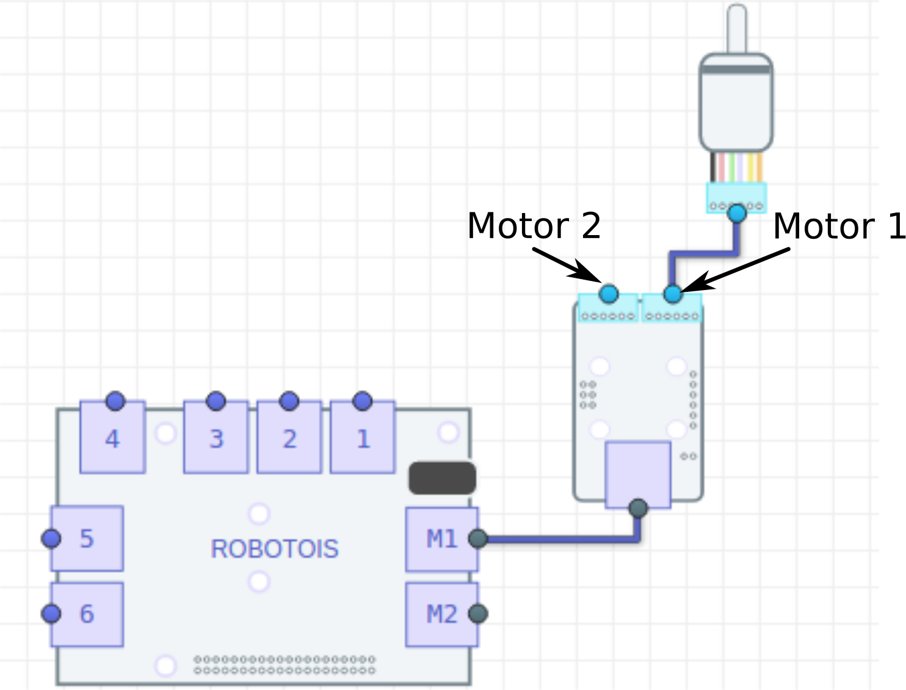

# Primeros Pasos con el Módulo de Motores
El módulo de motores permite controlar hasta dos motores pequeños. Este módulo es un dispositivo basado en Arduino, ya que contiene un MCU Atmel (*ATmega328*) y un controlador dual para motores (*TB6612*).

Este módulo es uno de los mas avanzados dentro del kit *Robotois*, ya que el MCU se encarga de proporcionar las señales digitales en forma de PWM (*Pulse Width Modulation*) que necesita el driver de motores para funcionar de manera adecuada. Por otro lado, la comucación con la **PI** se realiza a través del puerto **IIC**, por lo que no es necesario especificar el puerto al cual se conecta en el **Shield**, sin embargo, es importante hacer énfasis en que este módulo se debe conectar únicamente en los puertos `M1-M2`, ya que en ellos se tienen las entradas de alimentación (voltaje) para los motores.

La comunicación con el módulo de mótores es bastante simple, porque solo se utilizan funciones genéricas y el MCU se encarga de generar las señales PWM de manera desatendida, es decir que no requiere intervención de la *PI*. Lo anterior nos permite enfocar el desarrollo de proyectos solo en base a si el robot debe moverse hacia adelante o hacia atrás, y con qué velocidad lo debe hacer.

## Instalación de la librería
La instalación de la librería se puede realizar usando el gestor de paquetes **[npm](https://www.npmjs.com/package/robotois-motors)** y a través del repositorio en **[GitHub](https://github.com/Robotois/robotois-motors)**. Para instalar el paquete con **npm** se ejecuta la siguiente línea en el *Shell*:

```Shell
npm install robotois-motors
```

Para instalar la última versión disponible en el repositorio de *Github*, se ejecuta lo siguiente:

```Shell
npm install git+https://github.com/Robotois/robotois-motors.git
```

## Conexión al Shield y conexión de motores al módulo

La conexión al *Shield* se realiza a través de los puertos `M1` y `M2`, en donde es posible conectar este módulo en cualquiera de dichos puertos. Los motores se conectan al módulo considerando que los conectores de motores tienen el orden que se muestra en la imágen, en donde se observa que, visto desde el ángulo del módulo de motores que está en la imágen, en el lado derecho está el conector del **Motor 1** y el conector del lado izquierdo es para el **Motor 2**.



## Función `motor1PWM()` y `motor2PWM()`
Estas funciones permiten establecer la velocidad con la que se moverán los motores `M1` y `M2` respectivamente. El rango de valores que aceptan estas funciones es de `(-100)-100`, en donde los valores negativos indican que el motor debe moverse en sentido contrario al horario (`Counter Clockwise`), consecuentemente los valores positivos indicarán al motor que se mueva en sentido horario (`Clockwise`). El valor `0` establecerá que el motor se detenga por completo.

Con base en lo anterior, el rango de valores `[-100, 0)` se utiliza para indicar la velocidad del motor para que éste gire en sentido contrario al horario. Es decir que, el valor `-100` es la velocidad máxima y la velocidad mínima se tiene con valores negativos muy cercanos a `0`.

Por otro lado, el rango de valores `(0, 100]` se utilizan para indicar la velocidad a la que se moverá el motor en sentido horario. En donde el valor `100` indica la velocidad máxima del motor en sentido horario y la velocidad mínima se obtendrá con valores positivos muy cercanos a `0`.

Es importante considerar que, aunque las velocidades se especifican con valores numéricos con decimales, internamente éstos se redondean con un dígito después del punto decimal para así obtener apropiadamente la señal digital (*PWM*) en el MCU. El siguiente ejemplo ilustra cómo se utilizan estas funciones:

```javascript
const Motors = require('robotois-motors');

const motors = new Motors();

motors.motor1PWM(50);

setTimeout(() => {
  motors.motor1Stop();
  motors.release();
}, 5000);
```

En este ejemplo se observa que se establece la velocidad del `50%` del máximo para el motor 1, y posteriormente después de 5 segundos se detiene y se libera el módulo.

En el siguiente ejemplo se ilustra un caso de prueba en donde se hacen girar los motores en un sentido y gradualmente se disminuye la velocidad para girar en sentido contrario. De manera específica, la velocidad de los motores iniciará en `-50` (en sentido anti horario), se disminuirá la velocidad hasta llegar a `0` para que posteriormente ésta sea aumentada hasta llegar a `50` (en sentido horario).

```javascript
const Motors = require('robotois-motors');

const motors = new Motors();
let pwm1 = -50;
let sum1 = 5;

let pwm2 = -50;
let sum2 = 5;

setInterval(() => {
  motors.motor1PWM(pwm1);

  if (pwm1 === 50) {
    sum1 = -5;
  }

  if (pwm1 === -50) {
    sum1 = 5;
  }

  pwm1 += sum1;
}, 1000);

setInterval(() => {
  motors.motor2PWM(pwm2);

  if (pwm2 === 50) {
    sum2 = -5;
  }

  if (pwm2 === -50) {
    sum2 = 5;
  }

  pwm2 += sum2;
}, 1000);
```

## La función `motorsPWM()`

Esta función realiza la misma tarea que las funciones `motor1PWM()` y `motor2PWM()` en conjunto. Sin embargo, `motorsPWM()` es mas eficiente en la forma de mandar las instrucciones, ya que ésta envía los valores de las velocidades en una sola transacción (en el puerto **IIC**). Caso contrario de las otras dos funciones, ya que para mandar las instrucciones cada una tiene que iniciar una transacción.

Es probable que en la mayoría de aplicaciones no se vea afectado el rendimiento del módulo de motores, pero para aplicaciones que demanden una gran cantidad de procesamiento por parte de la **PI**, o en donde se use de manera exhaustiva el puerto **IIC**, es más conveniente usar `motorsPWM()`.

En el siguiente ejemplo, se muestra una mejora al ejemplo anterior, en donde se hacía girar los motores en un sentido y luego en otro.

```javascript
const Motors = require('robotois-motors');

const motors = new Motors();

let pwm = -50;
let sum = 5;

setInterval(() => {
  motors.motorsPWM(pwm, pwm);

  if (pwm === 50) {
    sum = -5;
  }

  if (pwm === -50) {
    sum = 5;
  }

  pwm += sum;
}, 1000);
```
Como se observa, se simplifica de manera significativa la manera de establecer las velocidades de ambos motores. Es importante mencionar que el orden en que se especifican las velocidades de los motores es la siguiente `motorsPWM(pwm1, pwm2)`, en donde `pwm1` y `pwm2` son las velocidades de los motores 1 y 2 respectivamente.

## Funciones `motor1Stop()`, `motor2Stop()` y `motorsStop()`

Estas funciones como se puede deducir de sus respectivos nombres, se utilizan para detener el correspondiente motor. Es decir, que se puede detener el movimiento de los motores en cualquier momento. Estas funciones son muy útiles para proyectos como robots de búsqueda, o para evitar cosilisión con algún objeto.
