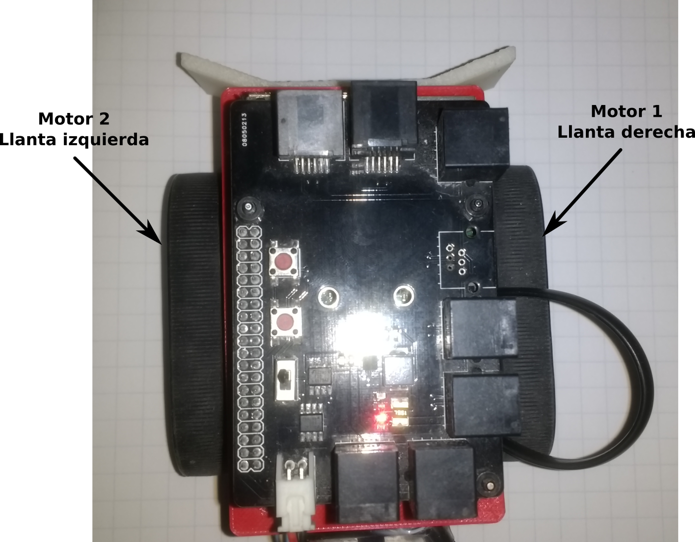

# Uso del Módulo de Motores en Robots
En esta documentación se abordará el caso de un robot con tracción diferencial, es decir, que el movimiento del robot se realiza a través de dos llantas, cada una con su respectivo motor.

En la siguiente imágen se muestra el robot **Robert** que se incluye en el kit **Robotois**, en donde se observa que se tienen dos llantas en forma de oruga, las cuales permiten a *Robert* moverse empleando una tracción diferencial.



En la imágen anterior se indica que el *Motor 1* (del módulo de motores), mueve la llanta derecha, y el *Motor 2* mueve la llanta izquierda. De esta manera, como se puede deducir, para que *Robert* se mueva hacia adelante, la llanta del lado derecho debe girar en sentido horario, y la llanta izquierda debe girar en sentido antihorario.

Con base en lo anterior, para avanzar hacia adelante y considerando que la velocidad de ambos motores debe ser la misma, se deben especificar las velocidades de los motores de la siguiente manera:

* Para el motor derecho la velocidad es positiva.
* Para el motor izquierdo la velocidad debe ser negativa.

Así por ejemplo, supongamos que la velocidad es de `50`, quedaría de la siguiente manera:

```javascript
motors.motorsPWM(50,-50);
```

## `drivePWM(leftPWM, rightPWM)`

La función `motorsPWM()` permite realizar movimientos en *Robert*, no obstante puede resultar confuso al momento de realizar movimientos hacia la izquierda o derecha debido a que se usan valores de velocidad con diferentes signos.

Por lo anterior, en esta librería se incluyó la función `drivePWM()`, la cual encapsula la lógica para hacer mover a *Robert*. En esta función es posible establecer la velocidad de ambos motores, pero considerando que cuando se tienen velocidades positivas `(0, 100]` ambas llantas girarán de manera que *Robert* se mueva hacia adelante, por otro lado cuando las velocidades son negativas `[-100, 0)` *Robert* se moverá hacia atrás. De manera específica, en esta función el primer argumento es para la velocidad del motor izquierdo y el segundo es para la velocidad del motor derecho,

Otra de las virtudes de la tracción diferencial consiste en que *Robert* puede girar hacia la derecha o la izquierda. Esto se realiza cuando existe una diferencia en la velocidad de los motores, para hacer girar a *Robert* se tienen los siguientes escenarios:

* Cuando la diferencia de velocidades en los motores es de tal manera que el motor izquierdo gira a una velocidad menor que el motor derecho, `leftPWM < rightPWM`, entonces *Robert* girará hacia la izquierda.

* Cuando se tiene que la diferencia de velocidades es tal que el motor derecho gira a una velocidad menor que el motor izquierdo `rightPWM < leftPWM`, entonces *Robert* girará hacia la derecha.

Es importante considerar que la velocidad con la que gira hacia la derecha o la izquierda, está determinada principalmente por la diferencia de velocidades, es decir que a mayor diferencia *Robert* girará mas rápido.

## Seguidor de Línea

A continuación se proporciona una versión funcional de un seguidor de línea usando a **Robert**. En esta aplicación, adicionalmente, se utiliza el módulo de **Sensores de Línea** para detectar la línea a seguir. De manera resumida, el algoritmo del seguidor de línea consiste en un control tipo PID, el cual consiste de lo siguiente:

* Se registra la lectura de la línea en cada iteración, usando `line.readLine()`, y se almacena la lectura previa usando las variables `lineReading` y `prevLineReading`. La variable `prevLineReading` es utilizada cuando *Robert* perdió la trayectoria, con lo cual se procede a tomar el último valor de línea registrado. Esto es útil para buscar la trayectoria hacia donde la última vez fue detectada.

* Se calcula el error en la línea, lo cual se realiza con la lectura actual y restando el valor equivalente a cuando la trayectoria se encuentra justo en el centro del módulo de sensores de línea (`200`). De igual manera que en el caso anterior se almacena el error de la iteración anterior para obtener el gradiente del error en la parte proporcional del controlador. La parte integral del error se calcula al realizar la suma acumulada de los errores en cada iteración.

* Posteriormente se calcula la diferencia que debe haber en la velocidad de los motores, la cual se almacena en la variable `powerDifference`. Y por último se establece dicha diferencia de velocidades en el módulo de motores, lo cual se realiza en la línea que contiene lo siguiente: `motors.drivePWM(leftPWM, rightPWM)`.

* Como se puede observar en el código, las iteraciones tienen un tiempo de diferencia de `10 ms`, lo cual se puede considerar que las iteraciones se ejecutan relativamente rápido. Esto se debe a que en este caso el tiempo de respuesta de *Robert* es crucial para que no se salga de la trayectoria.

```javascript
const Motors = require('robotois-motors');
const Line = require('robotois-line-sensors');

const motors = new Motors();
const line = new Line();

function lineFollower() {
  let lineReading, prevLineReading = 0, currentError, prevError = 0, maxPWM = 75,
    currentPWM = 10, leftPWM = currentPWM, rightPWM = currentPWM, kp = 2, ki = 0.0001,
    kd = 5, integral = 0, powerDifference = 0;

  function constrain(value, min, max) {
    if(value < min){
      return min;
    }
    if(value > max){
      return max;
    }
    return value;
  }

  function run() {
    lineReading = line.readLine();
    if (lineReading == -1.0) {
      lineReading = prevLineReading;
    }

    currentError = lineReading - 200;
    prevLineReading = lineReading;

    // PID control
    integral += currentError;
    powerDifference = currentError*kp + integral*ki + (currentError - prevError)*kd;
    prevError = currentError;

    if (powerDifference < 0.0) {
      leftPWM = constrain(currentPWM + powerDifference, 0, 100);
      rightPWM = currentPWM;
    } else {
      leftPWM = currentPWM;
      rightPWM = constrain(currentPWM - powerDifference, 0, 100);
    }

    motors.drivePWM(leftPWM, rightPWM);

    if(currentPWM < maxPWM){
      currentPWM += 0.1;
    }

    setTimeout(run,10);
  }

  run();
}

lineFollower();
```
